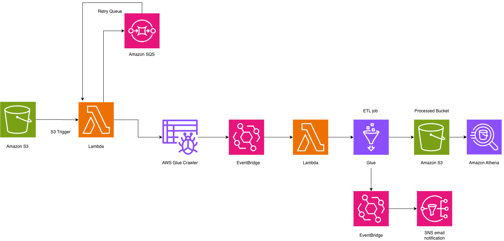

# Serverless Data Lake

A serverless AWS data pipeline for ingesting, cataloging, and processing data using AWS Glue, Lambda, EventBridge, S3, and Athena. This infrastructure automatically processes raw data files uploaded to S3, catalogs them in the AWS Glue Data Catalog, transforms them using a Glue ETL job, and makes the processed data queryable via Athena. Email notifications are sent upon completion.

## Architecture Overview



This Terraform project implements an automated data processing pipeline with the following components:

```
S3 (Raw Data) → Lambda → Glue Crawler → EventBridge → Lambda → Glue ETL Job → EventBridge → SNS Email
```

### Data Flow

1. **Data Ingestion**: Raw data files are uploaded to the S3 bucket in the `raw/` prefix
2. **S3 Event Trigger**: S3 bucket notifications trigger a Lambda function when new objects are created
3. **Catalog Discovery**: The Lambda function starts an AWS Glue Crawler to discover and catalog the schema
4. **Event-Driven Processing**: EventBridge detects when the Glue Crawler succeeds and triggers the next Lambda
5. **ETL Processing**: The second Lambda function starts a Glue ETL job that transforms the data
6. **Notification**: EventBridge detects ETL job completion and sends an email notification via SNS

## Infrastructure Components

### S3 Buckets

- **Raw Data Bucket**: Stores incoming raw data files in the `raw/` prefix

  - Configured with S3 event notifications to trigger Lambda on new object creation
  - Grants access permissions to Glue Crawler for data discovery

- **Scripts Bucket**: Stores the Glue ETL job Python script (`etljob.py`)
  - Automatically uploads the script from `./jobs/etljob.py` during deployment

### AWS Lambda Functions

#### 1. `data-lake-serverless` (S3 Trigger Lambda)

- **Trigger**: S3 bucket notification when objects are created in `raw/` prefix
- **Purpose**: Starts the Glue Crawler to discover and catalog new data
- **Runtime**: Node.js 20.x
- **Code Location**: `./lambda/startCrawler/index.mjs`
- **Permissions**: `glue:StartCrawler` on the crawler resource
- **Environment Variables**:
  - `CRAWLER_NAME`: Name of the Glue Crawler to start

#### 2. `glue-crawler-succeeded` (EventBridge Trigger Lambda)

- **Trigger**: EventBridge rule when Glue Crawler state changes to "Succeeded"
- **Purpose**: Starts the Glue ETL job after successful cataloging
- **Runtime**: Node.js 20.x
- **Code Location**: `./lambda/startJob/index.mjs`
- **Permissions**: `glue:StartJobRun` and `glue:GetJobRun` on the ETL job resource
- **Environment Variables**:
  - `JOB_NAME`: Name of the Glue ETL job to start

### AWS Glue

#### Glue Crawler

- **Name**: `crawler-datalake-serverless`
- **Target**: S3 path `s3://<project-name>/raw`
- **Database**: Creates and uses a Glue Data Catalog database with the project name
- **Purpose**: Automatically discovers schema and creates/updates tables in the Glue Data Catalog

#### Glue ETL Job

- **Name**: `etl-datalake`
- **Type**: Python shell with Spark
- **Script**: `s3://<project-name>-scripts/etljob.py`
- **Configuration**:
  - Glue Version: 5.0
  - Worker Type: G.1X
  - Number of Workers: 2
  - Execution Class: STANDARD
  - Timeout: 480 minutes
  - Max Retries: 0
- **Input**: Reads from Glue Data Catalog database and table
- **Output**: Writes processed data to `s3://<project-name>/processed/` in Parquet format
- **Transformations**:
  - Filters invalid records (passenger_count > 0, trip_distance > 0, fare_amount > 0)
  - Calculates derived fields (total_amount, trip_duration_minutes, trip_category, tip_percentage)
  - Performs data quality checks
  - Removes unnecessary fields

### Amazon EventBridge

Two EventBridge rules orchestrate the pipeline:

1. **`glue_crawler_succeeded`**

   - **Event Pattern**: AWS Glue Crawler State Change with state "Succeeded"
   - **Target**: Lambda function `glue-crawler-succeeded`
   - **Purpose**: Triggers ETL job start after successful cataloging

2. **`etl_job_succeeded`**
   - **Event Pattern**: AWS Glue Job State Change with state "SUCCEEDED"
   - **Target**: SNS topic for email notification
   - **Purpose**: Sends notification when ETL processing completes successfully

### Amazon SNS

- **Topic Name**: Uses the project name
- **Subscription**: Email subscription to the address specified in `sns_topic_email_endpoint`
- **Purpose**: Sends email notifications when the ETL job completes successfully

### Amazon Athena

- **Workgroup Name**: Uses the project name
- **Table Name**: `athena_table`
- **Purpose**: Provides serverless SQL query capability for analyzing processed data stored in Parquet format
- **Configuration**:
  - Engine Version: AUTO
  - Managed Query Results: Enabled
  - Data Source: Queries the processed data from `s3://<project-name>/processed/`
  - Format: Parquet (external table in Glue Data Catalog)

## Prerequisites

- Terraform >= 1.0
- AWS CLI configured with appropriate credentials
- An AWS account with permissions to create:
  - S3 buckets and objects
  - Lambda functions and their IAM roles
  - Glue databases, crawlers, and jobs
  - EventBridge rules
  - SNS topics and subscriptions

## Configuration

### Required Variables

Create a `terraform.tfvars` file with the following variables:

```hcl
project_name               = "your-project-name"
sns_topic_email_endpoint   = "your-email@example.com"
```

- **`project_name`**: Used as a prefix for most AWS resources. Must be globally unique for S3 buckets.
- **`sns_topic_email_endpoint`**: Email address that will receive notifications when the ETL job succeeds.

### Variables

- `project_name` (string, required): The name of the project. Used as a prefix for AWS resources.
- `sns_topic_email_endpoint` (string, required): Valid email address to subscribe to SNS topic for notifications.

## Deployment

1. **Initialize Terraform**:

   ```bash
   terraform init
   ```

2. **Review the execution plan**:

   ```bash
   terraform plan
   ```

3. **Apply the configuration**:

   ```bash
   terraform apply
   ```

4. **Confirm SNS subscription**: After deployment, check your email and confirm the SNS subscription to receive notifications.

## Usage

### Uploading Data

1. Upload raw data files to the S3 bucket in the `raw/` prefix:

   ```bash
   aws s3 cp your-data-file.json s3://<project-name>/raw/
   ```

2. The pipeline will automatically:
   - Trigger the Lambda function
   - Start the Glue Crawler to catalog the data
   - Wait for EventBridge to detect crawler completion
   - Start the ETL job to process the data
   - Write processed data to `s3://<project-name>/processed/`
   - Send an email notification upon completion

### Monitoring

- **Lambda Logs**: Available in CloudWatch Logs at `/aws/lambda/<function-name>`
- **Glue Jobs**: Monitor in AWS Glue console under Jobs → `etl-datalake` → Runs
- **EventBridge**: View event history in EventBridge console

## ETL Job Details

The Glue ETL job (`etljob.py`) performs the following transformations:

1. **Data Quality Filtering**: Removes records with invalid passenger counts, trip distances, or fare amounts
2. **Calculated Fields**:
   - `total_amount`: Sum of all fare components
   - `trip_duration_minutes`: Time difference between pickup and dropoff
   - `trip_category`: Classifies trips as "High Value" (>$50) or "Standard"
   - `tip_percentage`: Calculates tip as percentage of fare amount
3. **Field Removal**: Drops unnecessary fields (mta_tax, extra, improvement_surcharge, etc.)
4. **Output Format**: Writes data in Parquet format with Snappy compression

## Module Structure

- `modules/s3/`: S3 bucket creation with optional Lambda triggers and object uploads
- `modules/lambda/`: Lambda function deployment with IAM roles and CloudWatch logging
- `modules/glue/`: Glue database, crawler, and ETL job configuration
- `modules/athena/`: Athena workgroup and Glue catalog table configuration for querying processed data

## Outputs

The following outputs are available after deployment:

### S3 Buckets

- `s3_bucket_name`: Name of the raw data S3 bucket
- `s3_bucket_arn`: ARN of the raw data S3 bucket
- `s3_scripts_bucket_name`: Name of the S3 scripts bucket (stores ETL job script)

### Lambda Functions

- `s3_lambda_trigger_function_name`: Name of the S3-triggered Lambda function (`data-lake-serverless`)
- `s3_lambda_trigger_function_arn`: ARN of the S3-triggered Lambda function
- `glue_crawler_succeeded_lambda_function_name`: Name of the Glue crawler succeeded Lambda function

### AWS Glue

- `glue_crawler_name`: Name of the Glue crawler
- `glue_database_name`: Name of the Glue Data Catalog database
- `etl_job_name`: Name of the Glue ETL job
- `etl_job_arn`: ARN of the Glue ETL job

### Amazon Athena

- `athena_workgroup_name`: Name of the Athena workgroup
- `athena_workgroup_arn`: ARN of the Athena workgroup
- `athena_table_name`: Name of the Athena table for querying processed data

### Amazon SNS

- `sns_topic_arn`: ARN of the SNS topic for email notifications

## Cleanup

To destroy all created resources:

```bash
terraform destroy
```

**Note**: Ensure all data and objects in S3 buckets are removed or the buckets are emptied before running `terraform destroy`, as Terraform cannot delete non-empty S3 buckets.

## Notes

- The diagram referenced in `assets/diagram.png` shows a conceptual architecture that includes an SQS retry queue, which is not currently implemented in this codebase. This could be added as a future enhancement for handling Lambda failures with retry logic.
- The processed data bucket is currently configured to use the same bucket as the raw data, with a different prefix (`processed/`). A separate processed bucket module is commented out in `main.tf` if you prefer separate buckets.
